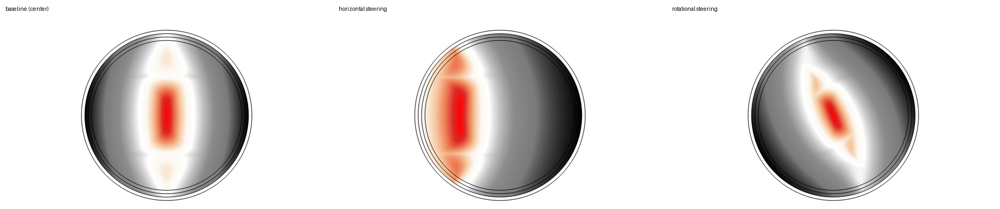
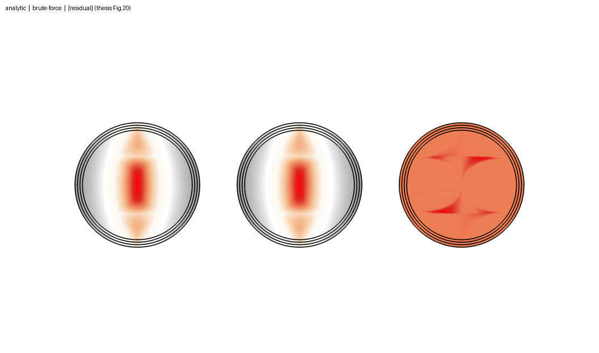
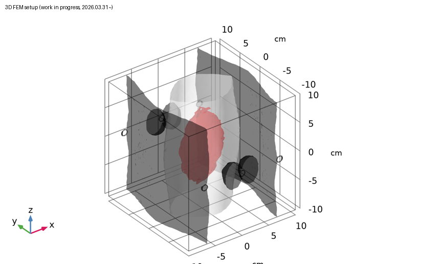

# Multi-source / Multi-channel TIS — 왜 3-phase가 필요한가

> 작성: 2026-06-23
> 커리큘럼: 5/13단계
> 참고: 회의록 260618_180422 (참석자 1 설명), 송솔웅 nTIS 전기장 계산 2026, 김대용 COMSOL 2025–2026
> 수식 표기: Unicode/ASCII (LaTeX 없음, CLI 직독 가능)

---

## 학습 목표

2-phase TIS의 3가지 근본 한계를 이해하고, 그것을 해결하기 위해
Multi-channel TIS와 3-phase TIS가 어떻게 설계되었는지 수식과 직관으로 설명할 수 있다.

---

## 0. 출발점: 2-phase TIS는 무엇을 증명했는가

Grossman 2017 (Cell)이 증명한 것:

```
"피부 전극으로 깊은 신경을 비침습적으로 자극할 수 있다" ✅
```

Grossman 2017이 증명하지 못한 것:

```
"원하는 신경만 골라서, 원하는 방향으로, 어떤 환자에게도 자극할 수 있다" ❌
```

이 세 가지 못한 것이 바로 2-phase TIS의 3가지 한계다.

---

## 1. 2-phase TIS의 3가지 근본 한계

### 한계 1: 자극 영역이 너무 넓다 (Focality 부족)

AM 공식:

```
AM = 2 × min(|E₁|, |E₂|)

→ 두 전기장이 "둘 다 충분히 강한" 곳에서 자극 발생
```

공간에서 어떻게 생기는가:

```
전극 쌍 A의 "충분히 강한" 구역:   전극 쌍 B의 "충분히 강한" 구역:
  ┌───────────────────────┐           ┌───────────────────────┐
  │  ░░░░░░░░░░░░░░░░░    │           │    ░░░░░░░░░░░░░░░░░  │
  │ ░░░░░░░░░░░░░░░░░░░   │           │   ░░░░░░░░░░░░░░░░░░░ │
  │░░░░░░░░░░░░░░░░░░░░░  │           │  ░░░░░░░░░░░░░░░░░░░░░│
  └───────────────────────┘           └───────────────────────┘
         수평 방향으로 긴 띠                 수직 방향으로 긴 띠

교집합 = 실제 자극 영역:
  ┌───────────────────────┐
  │                       │
  │       ░░░░░░░         │  ← 생각보다 훨씬 넓다
  │      ░░░░░░░░░        │
  │       ░░░░░░░         │
  │                       │
  └───────────────────────┘
```

왜 넓은가:

```
전기장은 전극에서 멀어질수록 서서히 감소한다.

세기
│████
│████████
│████████████
│████████████████░░░░░
│████████████████░░░░░░░░░
└──────────────────────────→ 거리

█ = 충분히 강한 구역 (경계가 뭉툭함)

두 전극쌍의 뭉툭한 구역이 겹치면 → 자극 영역도 뭉툭하게 넓다.
```

임상적 결과:

```
뇌 자극 (Grossman 2017 마우스):
  뇌 내부는 신경이 빽빽 → 넓어도 OK, 어차피 다 신경

말초신경 자극 (현실):
  경골신경: 직경 2~3mm 가느다란 신경 하나
  주변: 근육, 혈관, 다른 신경들

  2-phase 자극 영역 (수 cm²)
  vs
  경골신경 크기 (2~3mm)

  → 주변 근육 수축, 다른 신경 활성화, 불쾌감 발생
```

---

### 한계 2: 표적을 전자적으로 3D 이동할 수 없다 (Steering 제한)

2-phase에서 표적 이동 방법:

```
I₁ : I₂ 비율 조절 → 표적이 두 전극쌍 잇는 축 방향으로만 이동

  가능:  ←────────────────→  (1D, 한 방향만)

  불가:  ↑↓ / ↗↙ / 전후 방향 이동 → 전극을 물리적으로 다시 붙여야 함
```

임상적 문제:

```
환자 A: 경골신경이 여기 있음  ●
환자 B: 경골신경이 여기 있음    ●  (해부학이 조금 다름)

2-phase: 환자마다 전극을 다시 붙여야 함
3-phase: 전류 파라미터만 바꾸면 표적 이동 가능
```

---

### 한계 3: 자극 방향을 바꿀 수 없다 (Direction 제어 불가)

회의록 핵심 (참석자 1, 14:55):

```
"3상은 직선으로 안 나타나.
 벡터가 이렇게 됐다가 이렇게 됐다가 이렇게 되는 거지."
```

2-phase에서 한 점의 전기장 궤적:

```
E⃗(t) = E⃗₁·cos(ω₁t) + E⃗₂·cos(ω₂t)

E⃗₁과 E⃗₂는 전극 배치로 고정된 벡터.
→ E⃗(t)는 이 두 벡터의 선형결합
→ span{E⃗₁, E⃗₂} = 2D 평면 밖으로 절대 못 나감

한 점에서 E⃗(t) 궤적:

  E_y
   ↑
   │
   │      (직선으로 왔다 갔다)
   │  ←──────────────────→
   │
   └──────────────────────→ E_x

= "직선" 궤적
```

문제:

```
경골신경 섬유가 z축 방향으로 달린다:

      발목 위  ↑
               │ ← 신경 방향 (z축)
      발목 아래 ↓

2-phase 전기장: ←────────→ (x축 방향으로만 왔다 갔다)

신경 방향(z)과 전기장 방향(x)이 다름
→ 자극 효율 저하

해결하려면? 전극을 물리적으로 다시 배치해야 함.
전류 파라미터로는 방향 바꾸기 불가.
```

---

## 2. 3가지 문제 요약

```
┌──────────────────┬──────────────────────┬──────────────────────┐
│                  │  2-phase TIS         │  3-phase TIS         │
├──────────────────┼──────────────────────┼──────────────────────┤
│ ① 자극 영역     │ 넓음 (blob)          │ 좁음 (더 집중)       │
│                  │ 신경 주변까지 자극   │ 신경 위주로 자극     │
├──────────────────┼──────────────────────┼──────────────────────┤
│ ② 표적 이동     │ 1D (선 방향만)       │ 3D (전방향)          │
│   (Steering)     │ 전극 이동 필요       │ 전류 파라미터만 조정 │
├──────────────────┼──────────────────────┼──────────────────────┤
│ ③ 자극 방향     │ 고정 (전극 배치로)   │ 임의 방향 선택 가능  │
│                  │ 전극 재배치 필요     │ 신경 축에 맞게 조정  │
└──────────────────┴──────────────────────┴──────────────────────┘
```

---

## 3. 왜 채널 수가 늘면 자극 영역이 좁아지는가

### 3-1. 제약 조건 교집합 원리

```
2채널: AM > T  ⟺  두 조건 동시 만족
  → {|E₁| > T/2} ∩ {|E₂| > T/2}  = 넓은 교집합

n채널: AM > T  ⟺  n개 조건 동시 만족
  → {|E₁| > T/n} ∩ {|E₂| > T/n} ∩ ... ∩ {|Eₙ| > T/n}  = 좁은 교집합

조건이 많을수록 교집합이 작아진다.
```

비유 (GPS 위성):

```
위성 2개: 가능한 위치가 두 점 중 하나 (넓음)
위성 3개: 가능한 위치가 정확히 한 점 (좁음)

2-phase TIS = 위성 2개 → 넓은 자극 영역
3-phase TIS = 위성 3개 → 좁은 자극 영역
```

### 3-2. 구체적 숫자

```
표적 지점 r*:
  채널 1: E₁ = 5 V/m
  채널 2: E₂ = 5 V/m
  AM = 2 × min(5,5) = 10 V/m ✓

표적에서 1cm 이동 (2채널):
  채널 1: E₁ = 6 V/m (가까워짐)
  채널 2: E₂ = 4 V/m (멀어짐)
  AM = 2 × min(6,4) = 8 V/m  ← 여전히 80%, 자극 유지됨

표적에서 1cm 이동 (4채널):
  채널 1: E₁ = 6 V/m
  채널 2: E₂ = 4 V/m
  채널 3: E₃ = 4 V/m
  채널 4: E₄ = 3 V/m  ← 어딘가 전극에서 멀어짐
  AM = 2 × min(6,4,4,3) = 6 V/m  ← 60%, 자극 약해짐
```

더 많은 채널 → 어떤 방향으로 이동해도 반드시 멀어지는 채널이 생긴다 → AM이 더 빠르게 감소.

---

## 4. 2D vs 3D — 전기장 궤적의 차이

### 4-1. 2-phase: 직선 궤적 (2D 평면에 갇힘)

```
E⃗(t) = E⃗₁·cos(ω₁t) + E⃗₂·cos(ω₂t)

E⃗₁, E⃗₂ 두 벡터의 선형결합
→ span{E⃗₁, E⃗₂} = 2D 평면 밖을 못 나감

한 점에서 궤적: 직선 (왔다 갔다)

AM_max 방향 u₁:
  → span{E⃗₁, E⃗₂} 평면 안에서만 존재 가능
  → 이 평면에 수직인 방향으로는 AM_max 불가
```

### 4-2. 3-phase: 타원 궤적 (3D 전방향)

```
Iₐ = I·cos(ωt + 0°)
Ib = I·cos(ωt + 120°)
Ic = I·cos(ωt + 240°)

세 전류는 동시에 최대가 되지 않음 → 합벡터가 돈다

한 점에서 궤적: 타원 (회전)

  E_y
   ↑
   │    ╭──────────╮
   │  ╱   ←──←──←  ╲
   │ │↙               ↑│
   ●─│─────────────────│──→ E_x
   │ │↖               ↓│
   │  ╲   →──→──→  ╱
   │    ╰──────────╯

타원 장축 방향 = AM_max 방향 (u₁)
→ 전극 배치 + 전류 최적화로 임의 3D 방향 선택 가능
```

SVD 관점:

```
M 행렬의 열공간(column space) = AM_max가 향할 수 있는 방향들

2-phase:
  M = [Re(Ẽ₁), Im(Ẽ₁), Re(Ẽ₂), Im(Ẽ₂)]  (3×4)
  열공간 = span{E⃗₁, E⃗₂} = 최대 2D

3-phase:
  M = [Re(Ẽ₁), Im(Ẽ₁), Re(Ẽ₂), Im(Ẽ₂), Re(Ẽ₃), Im(Ẽ₃)]  (3×6)
  열공간 = span{E⃗₁, E⃗₂, E⃗₃} = 3D (세 벡터가 선형독립이면)

AM_max = 2·σ₁(M)

결론:
  2-phase: u₁이 2D 평면 안에서만 존재 가능
  3-phase: u₁이 3D 임의 방향 가능
```

---

## 5. 위상이 반드시 0°/120°/240° 이어야 하는가?

### 아니다. 0°/120°/240°는 하나의 특수 선택이다.

이 선택의 장점:

```
전류 균형 조건 자동 만족:

Iₐ + Ib + Ic = I·[cos(0°) + cos(120°) + cos(240°)]
              = I·[1 + (-1/2) + (-1/2)]
              = 0

→ Ground 전극 없이 3개만으로 닫힌 회로 가능 (전극 1개 절약)
→ Kirchhoff 전류 법칙 자동 만족
```

위상 공간 균등 커버:

```
Im
↑   ● 120°
│  ╱
│ ╱  120°
●──────→ Re
│╲ 120°
│ ╲
│  ● 240°

세 phasor가 120° 간격 → 복소평면을 균등 분할
→ 특정 방향 편향 없이 등방성(isotropic) 자극 가능
```

다른 위상도 가능하다:

```
일반적으로 최적화 문제로 품:

  목적: AM_max(표적) 최대화
        AM_max(비표적) 최소화

  변수: φ₁, φ₂, φ₃ (위상)
        I₁, I₂, I₃  (진폭)

→ 표적 위치, 신경 방향, 조직 형태에 따라 최적 위상이 달라진다.
0°/120°/240°는 편리한 초기값일 뿐.
```

---

## 6. 전극 선형독립 조건 — 3D AM_max를 달성하려면

3-phase TIS가 3D AM_max를 달성하는 조건:

```
span{E⃗₁(r*), E⃗₂(r*), E⃗₃(r*)} = ℝ³

→ 세 전극 쌍의 전기장 벡터가 표적 r*에서 선형독립이어야 한다.
```

실패 케이스:

```
실패 1: 모든 전극 쌍이 평행
  E⃗₁ ∥ E⃗₂ ∥ E⃗₃ → span = 1D (직선만)

실패 2: 모든 전극 쌍이 한 평면에 있음
  발목 피부 위에 전극 3쌍을 모두 transverse 방향으로 배치
  → E⃗₁, E⃗₂, E⃗₃ 모두 x-y 평면에 있음
  → span = 2D, z축 성분 없음
  → 경골신경 방향(z)으로 AM_max 불가

해결책:
  전극 쌍 중 하나를 발목 위아래 방향(z축)으로 배치
  → E⃗₃에 z 성분 추가 → span = 3D ✅
```

Lead Field 행렬 관점:

```
F(r*) = [E⃗₁(r*) | E⃗₂(r*) | E⃗₃(r*)]  ← 3×3 행렬

rank(F) = 1: 모두 평행 (최악)
rank(F) = 2: 한 평면 (2D만)
rank(F) = 3: 선형독립 (3D 완전 제어) ← 목표

→ COMSOL 전극 최적화 시 rank(F) 확인 필수
  (김대용 260518_Leadfield 연구 핵심)
```

---

## 7. 전체 논리 지도

```
┌─────────────────────────────────────────────────────────────┐
│                                                             │
│  Grossman 2017: 2-phase TIS                                 │
│  ✅ 증명: 깊은 곳을 비침습으로 자극할 수 있다              │
│  ❌ 한계: 넓은 blob / 1D steering / 방향 고정              │
│                     ↓                                       │
│  해결: 채널 수 증가 (Multi-channel TIS)                     │
│  → 더 많은 채널 = 더 많은 조건 교집합 = 좁은 자극 영역     │
│                     ↓                                       │
│  3-phase TIS (3쌍, 120° 위상 간격)                         │
│  ① 자극 영역 좁힘   → "원하는 곳만" 해결                   │
│  ② 3D 전자 조향     → "어떤 환자에게도" 해결               │
│  ③ 방향 제어        → "원하는 방향으로" 해결               │
│                     ↓                                       │
│  수식: AM_max = 2·σ₁(M)                                    │
│  M 열공간 = 3D (전극 선형독립 조건 충족 시)                 │
│  → u₁ 방향을 경골신경 축으로 정렬 가능                     │
│                                                             │
└─────────────────────────────────────────────────────────────┘
```

---

## 8. 핵심 한 줄 요약

```
2-phase TIS: "깊은 곳을 자극할 수 있다" 증명 ✅
             "원하는 곳만, 원하는 방향으로, 어떤 환자에게도" ❌

3-phase TIS: 위 세 가지를 동시에 해결하기 위해 개발됨.
```

---

## 자기평가 문항

**Lv.1** 2-phase TIS의 3가지 한계를 각각 한 문장으로 설명하라.

**Lv.2** "AM_max 방향이 2D 평면에 갇힌다"는 것을 span{E⃗₁, E⃗₂} 언어로 설명하라.

**Lv.2** 0°/120°/240° 위상이 아닌 다른 위상을 쓸 수 있는 이유는?

**Lv.3** 채널 수가 2 → 4 → 8로 늘어날 때 자극 영역이 좁아지는 이유를 "조건 교집합" 원리로 설명하라.

**Lv.4** 발목에 3-phase TIS를 적용할 때 rank(F) = 3이 되려면 전극을 어떻게 배치해야 하는가?

**Lv.4** (도전) 4채널 TIS와 3-phase TIS는 다른 개념인가? 차이점은?

---

## 9. STEP 6 — 3-phase TIS 수식 심화 (송솔웅 박사학위논문 기반)

> 추가: 2026-07-09
> 출처: 송솔웅, *Development of a non-invasive deep tissue electrical stimulation: n-phase temporal interference stimulation*, 한양대 박사학위논문(2026.02), `docs/07_Meeting/nTIS_프리젠테이션/송솔웅/Manuscript/Thesis_SolwoongSong_Uploaded.pdf` Chapter 2–4
> 위 STEP 5(1~8절)가 "왜 3-phase가 필요한가"를 다뤘다면, 이 절은 3-phase(N=3인 nTIS)가 실제로 **어떻게 타원 궤적·최대 envelope·조향을 수식으로 구현하는지**를 논문 원문 그대로 정리한다.

### 9-1. 채널 전류 정의와 zero-sum 조건

각 채널 k(=1..N, 3-phase면 N=3)의 전류:

```
I_k(t) = A_k · cos(ωt + φ_k)
```

물리적 안전조건(전극에 DC가 안 쌓이게):

```
Σ I_k(t) = 0   (모든 t에서)

⟺  Σ A_k·cos(φ_k) = 0,   Σ A_k·sin(φ_k) = 0
```

이 조건을 만족하면 총 전기장은 두 개의 quadrature 벡터로 압축된다:

```
E(t) = C·cos(ωt) + S·sin(ωt)
   C = Σ A_k·cos(φ_k)·E_k(r),   S = Σ A_k·sin(φ_k)·E_k(r)
```

N=2(기존 TIS)에서는 C, S가 항상 평행 → E(t)가 직선. **N≥3부터 C, S가 일반적으로 평행하지 않게 되고, 이때 E(t)의 끝점이 타원을 그린다.** 이것이 3-phase가 "회전"을 만드는 최소 조건인 이유다.

### 9-2. 타원의 닫힌 형태(closed-form)

한 공간점에서 두 직교 성분:

```
Ex(t) = Ax·cos(τ),   Ey(t) = Ay·cos(τ+δ)     (τ = ωt+φx, δ = 위상차)
```

행렬로 쓰면:

```
[x]   [Ax        0      ] [cosτ]
[y] = [Ay·cosδ  -Ay·sinδ] [sinτ]
```

[cosτ, sinτ]가 원을 그리므로 이 선형변환 결과는 **타원**(δ=0이면 직선으로 퇴화). 장축 a, 단축 b, 방향 φ는 다음 행렬의 고유값/고유벡터:

```
S = [ Ax²         Ax·Ay·cosδ ]
    [ Ax·Ay·cosδ     Ay²     ]

a², b² = (Ax²+Ay²)/2 ± (1/2)·√[(Ax²-Ay²)² + 4·Ax²·Ay²·cos²δ]
φ = (1/2)·atan2(2·Ax·Ay·cosδ,  Ax²-Ay²)
```

임의 방향 θ로의 투영(project) 길이:

```
ρ(θ) = √[ a²cos²(θ-φ) + b²sin²(θ-φ) ]
```

### 9-3. Envelope 최대값 — 3가지 케이스

3-phase TIS는 서로 다른 두 반송주파수(f1, f2)를 쓰므로, 한 공간점에 **타원이 2개**(각 주파수당 1개) 존재한다. envelope은 두 타원의 투영 비교로 결정된다:

```
E_AM(θ)     = 2·min(ρ1(θ), ρ2(θ))
E_AM_max    = max_θ [ E_AM(θ) ]
```

| 케이스 | 조건 | 결과 |
|---|---|---|
| **1. 일치** | a1=a2, b1=b2, φ1=φ2 | E_AM_max = 2a (장축에서 최대) |
| **2. 한쪽 압도** | 큰 타원이 작은 타원의 장축 방향에서도 2·a_small 이상 | E_AM_max = 2·a_small (작은 타원의 장축이 병목) |
| **3. 교차** | 두 타원의 투영곡선이 서로 역전되는 방향 존재 | 두 투영이 같아지는 방향(교차점)에서 E_AM_max 결정 |

기존 TIS(직선) 공식 `E_AM_max = 2‖E2‖` 또는 `2‖E1×E2‖/‖E1-E2‖`의 **타원 버전 일반화**다 — Case 2가 기존 TIS의 "포화" 케이스, Case 3이 "사선 균형" 케이스에 대응한다.

### 9-4. FEM 시뮬레이션 검증 (COMSOL 6.3, AC/DC 모듈)

- 2D 원형 도메인(반지름 25mm, water), 전극을 30° 간격 배치, 접지전극 1개
- 각 채널의 (A_k, φ_k)를 조합해 실제로 확인한 것: **전극 위치는 고정한 채 위상만 바꿔서** envelope 최대 지점을 수평/수직/대각선/회전으로 자유롭게 이동



*(baseline → horizontal steering → rotational steering. 전극은 그대로, 전류의 진폭·위상 조합만 바뀜 — 원 논문 Figure 17~19에 해당)*

**해석해(analytic) vs brute-force 검증**: 위 9-3의 닫힌 형태 수식으로 계산한 E_AM_max와, 실제 시간영역에서 여러 주기 동안 필드를 직접 계산해 최대/최소를 잡아낸 brute-force 값을 비교:



*(residual Δ_AM = |E_AM_analytic − E_AM_brute|는 envelope 진폭이 0에 가까운 영역에서만 미세하게 남고, 자극에 실제 의미 있는 고진폭 영역에서는 체계적 오차 없음 — 원 논문 Figure 20)*

### 9-5. 실험 검증 — LED phantom

- 위상 동기화 다채널 신호 발생기(공통 clock, sub-degree 위상 안정성 확인) + 증폭 + **LED phantom**
- LED phantom: 저주파 envelope 성분만 선택적으로 뽑아 밝기로 시각화 (생체조직 없이 물리적으로 확인)
- 위상을 돌리면 LED 밝기 패턴도 같이 회전 → FEM 예측과 정성적으로 일치

### 9-6. 논문이 명시한 한계

- 이론·시뮬레이션 모두 **2D 평면**에 한정 (3D 일반화는 future work)
- LED phantom은 생체조직 유전특성 미반영 → "공학적 실현 가능성"까지만 증명, 신경 자극 효과 자체는 미검증
- in vivo/ex vivo 실험 없음 → 신경 활성화·행동 효과에 대한 인과적 주장은 아직 불가

### 9-7. 후속 진행 상황 — 3D 확장 (2026.03.31~, 진행 중)

학위논문(2D) 이후 실제로 3D 일반화 작업이 시작됐다 (`20260331_송솔웅_nTIS_전기장계산.pptx`):

- COMSOL에서 두 주파수(f1, f2) 각각의 Ex/Ey/Ez phasor를 export → MATLAB(`nTIS_3D_260331.m`)에서 재구성
- 문제를 **"두 개의 non-coplanar(같은 평면에 있지 않은) 타원의 3D 투영"**으로 일반화
- 제약조건 2개를 건 **Lagrange multiplier 방법**으로 constrained optimization을 풀어 3D E_AM_max를 구하는 단계까지 진행



*(회색 판 = COMSOL에서 export한 Ex/Ey/Ez 슬라이스, 빨간 영역 = 타겟 구조물, 검은 원기둥 = 전극 — 2D 원형 도메인 검증을 3D 해부학적 구조로 확장하는 중간 단계)*

이 3D 수식(Lagrangian, stationarity 조건 등)은 슬라이드 텍스트만으로는 최종 형태가 다 드러나지 않아, 필요하면 해당 pptx의 수식 슬라이드나 `nTIS_3D_260331.m` 코드를 직접 열어 확인해야 한다.

---

*Last updated: 2026-07-09*
*다음 단계: STEP 6 3D 확장 — Lagrange multiplier 기반 3D envelope 최적화 (진행 중)*
